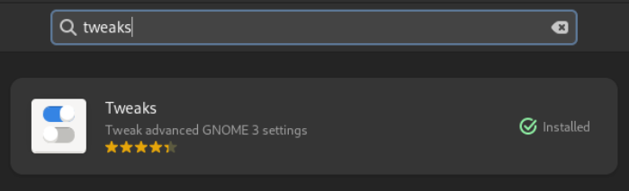
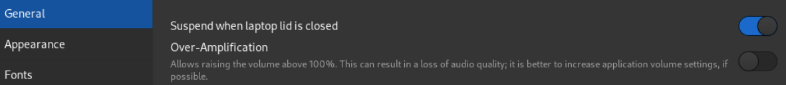

# Complete config of XRDP on linux (in my case - fedora)

## Install xrdp 

```shell
sudo dnf install xrdp -y
```

Various Linux distribution may have diffrent install instructions, so you need to check out install tutorial for your distro.

## Disable suspend when laptop lid is closed

If you're using GNOME GUI you have to install **Tweaks** from *appstore*




Disable **Suspend when laptop lid is closed**



## Edit logind.conf as below:

```shell
sudo vi /etc/systemd/logind.conf
```

Find **HandleLidSwitch** and remove hash and change it to **ignore**

```shell
...
#HandleHibernateKey=hibernate
#HandleHibernateKeyLongPress=ignore
HandleLidSwitch=ignore
#HandleLidSwitchExternalPower=suspend
#HandleLidSwitchDocked=ignore
...
```

Restart **systemd-logind**

```shell
sudo systemctl restart systemd-logind
```

